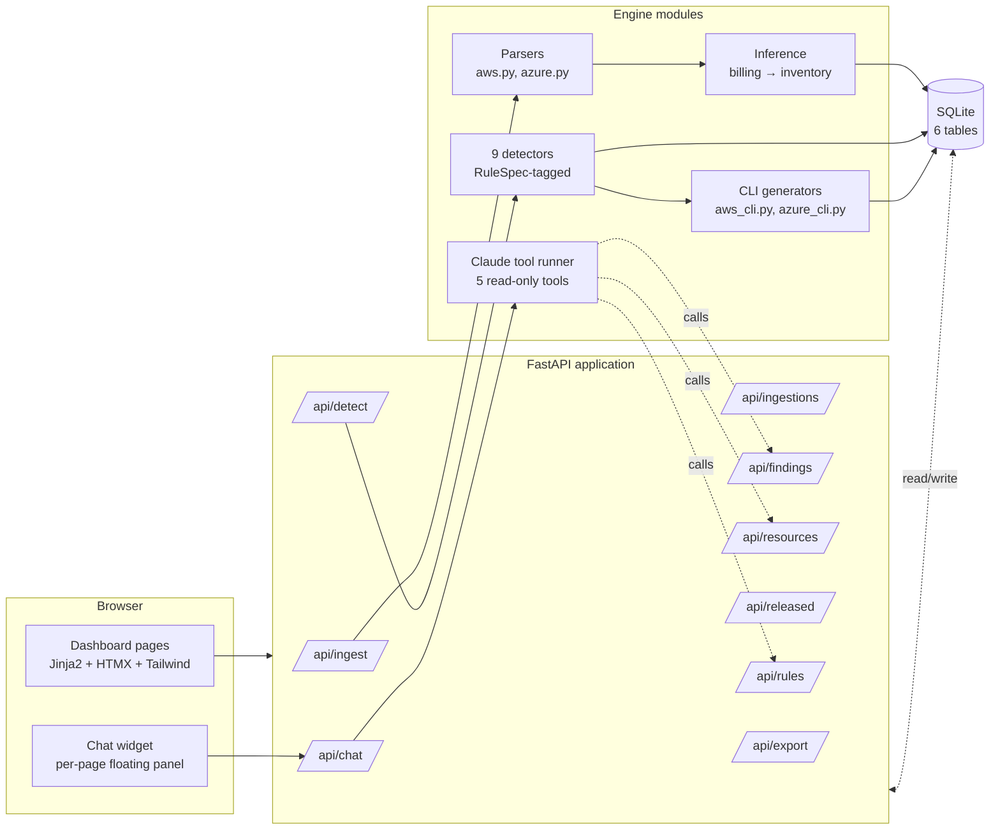
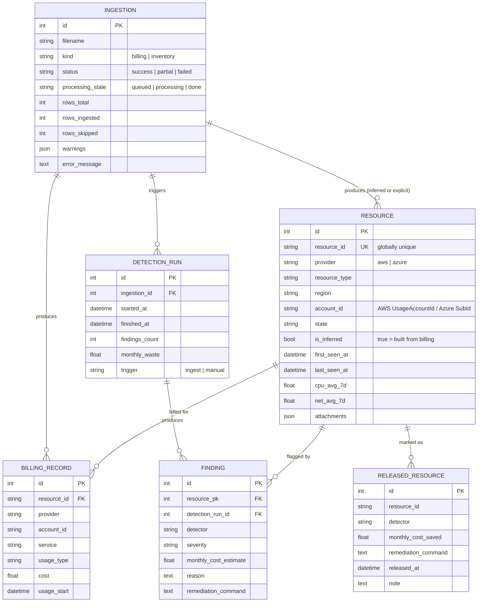

# Cloud Cost Optimizer & Remediation Engine

API-first FinOps service that ingests AWS and Azure billing + inventory exports,
detects orphaned/idle resources via a pluggable rule engine, and generates the
exact CLI commands needed to decommission them — **never executes any
destructive action itself**. Includes a Claude-powered natural-language query
bar and a full audit log (every ingest → detection run → finding → release).

> Built over the course of one focused session. All work and decisions are
> recorded in [`prompts.md`](prompts.md).

---

## Table of contents

- [Goal](#goal)
- [Quick start](#quick-start)
- [How it works](#how-it-works)
  - [Component overview](#component-overview)
  - [Ingestion → detection → release flow](#ingestion--detection--release-flow)
  - [Data model](#data-model)
  - [Module layout](#module-layout)
- [What it detects](#what-it-detects)
- [API endpoints](#api-endpoints)
- [Strong points](#strong-points)
- [Room for improvement](#room-for-improvement)
- [Testing](#testing)
- [Development](#development)
- [Safety boundary](#safety-boundary)

---

## Goal

FinOps tooling tends to either be "give us your cloud credentials and we'll do
everything" (high blast radius, hard to trust) or "here's a CSV of your spend"
(no actionable output). This project sits between the two: the engine takes
exports the operator already has, joins billing with inventory state, and
produces a *runbook* — concrete commands the operator copies and runs after
review. Marking a finding as released records the operator's commitment;
nothing happens in the cloud account until they run the command themselves.

The system targets four user needs:

1. **See what's wasteful right now** — orphan EBS volumes, idle EC2/Azure VMs,
   stale snapshots, idle load balancers, unassociated Elastic IPs.
2. **See what's been wasteful for a while** — resources billed for weeks with no
   sign of activity; idle EIPs encoded as such in CUR itself.
3. **Know which file said what** — every resource and finding traces back to
   the ingestion that produced it, with validation warnings preserved.
4. **Ask in plain English** — a chat widget translates natural questions into
   the engine's read-only API calls via Claude tool-use.

---

## Quick start

Requires [`uv`](https://docs.astral.sh/uv/) (`brew install uv` on macOS).

```bash
./run.sh
```

That runs `uv sync`, seeds demo data from `samples/`, and starts the API:

- Dashboard: <http://127.0.0.1:8000/>
- OpenAPI docs: <http://127.0.0.1:8000/docs>

To enable the **Claude-powered chat widget**, export an API key before starting:

```bash
export ANTHROPIC_API_KEY=sk-ant-...
./run.sh
```

Without the key the chat FAB greys out; the rest of the app works normally.

---

## How it works

### Component overview



The dashboard is plain server-rendered Jinja2 with a sprinkle of HTMX for
mutations. No SPA, no build step. Tailwind and Chart.js arrive via CDN.

### Ingestion → detection → release flow

```mermaid
sequenceDiagram
  autonumber
  participant U as Operator
  participant API as FastAPI handler
  participant BG as BackgroundTasks
  participant P as Parser + loader
  participant I as Inference
  participant D as Detectors
  participant DB as SQLite

  U->>API: POST /api/ingest/billing (multipart file)
  API->>API: Stream upload to temp file<br/>(shutil.copyfileobj, 64 KiB chunks)
  API->>DB: INSERT Ingestion(processing_state=queued)
  API-->>U: 200 { id, processing_state: "queued" }

  Note over BG: After HTTP response is sent
  BG->>P: Parse CSV / JSON
  P->>DB: INSERT BillingRecord rows
  BG->>I: Infer Resources from billing
  I->>DB: UPSERT Resource(is_inferred=true)
  BG->>D: run_all(ingestion_id=...)
  D->>DB: Read Resource + BillingRecord
  D->>DB: INSERT Finding rows
  BG->>DB: UPDATE Ingestion(processing_state=done)

  U->>API: GET /api/ingestions/{id}
  API-->>U: 200 { processing_state: "done", warnings, latest_detection_run }

  Note over U,DB: After review, operator releases a finding
  U->>API: POST /api/findings/{id}/release
  API->>DB: INSERT ReleasedResource, DELETE Finding
  API-->>U: 200 { monthly_cost_saved }

  Note over U,DB: Next ingest re-runs detectors; released pairs are suppressed
```

### Data model



The `(resource_id, detector)` pair on `RELEASED_RESOURCE` has a unique constraint
and is used to suppress findings on subsequent detection runs — once you've
marked a (resource, rule) pair released, it won't reappear unless you undo.

### Module layout

```
app/
├── main.py                       FastAPI app + lifespan
├── config.py                     Env-var thresholds + SUPPORTED_PROVIDERS
├── db.py                         SQLAlchemy engine + session_scope
├── models.py                     ORM tables
├── seed.py                       Demo data loader (uv run python -m app.seed)
├── reset.py                      CLI: drop + recreate schema (--yes)
│
├── ingest/                       File ingest path
│   ├── aws.py                       CUR CSV parser (UsageAccountId-aware)
│   ├── azure.py                     Cost Management JSON parser
│   ├── infer.py                     Billing → Resource inference (usage_type rules)
│   ├── loader.py                    DB writes + warning capture + reappearance check
│   └── stream.py                    Upload streaming + background task entrypoint
│
├── detectors/                    Pluggable rule engine
│   ├── base.py                      RuleSpec, ThresholdSpec, Detector protocol, cost estimator
│   ├── orphan_disk.py               AWS EBS + Azure managed disk
│   ├── idle_vm.py                   AWS EC2 + Azure VM (CPU/network thresholds)
│   ├── old_snapshot.py              Age-based
│   ├── idle_lb.py                   ALB/NLB/classic ELB with zero requests
│   ├── unassociated_eip.py
│   ├── idle_eip_billing.py          BILLING-ONLY (uses CUR usage_type)
│   ├── unmonitored_long_running.py  HISTORY-BASED (first_seen_at + recent cost)
│   └── registry.py                  ALL_DETECTORS list + run_all()
│
├── remediation/                  Safe CLI command builders
│   ├── aws_cli.py                   shlex-quoted; --dry-run on every destructive
│   └── azure_cli.py
│
├── ai/                           Claude-powered assistant (Opus 4.7 + tool runner)
│   ├── tools.py                     5 @beta_tool wrappers over internal API
│   └── chat.py                      Tool-runner orchestration (prompt-cached)
│
├── api/                          FastAPI routers, one concern each
│   ├── routes_ingest.py             Streaming upload + background task
│   ├── routes_ingestions.py         History + per-file detail
│   ├── routes_detect.py             Manual trigger
│   ├── routes_findings.py           Open findings + summary
│   ├── routes_resources.py          Inventory listing + per-resource detail + history
│   ├── routes_released.py           Single + bulk release
│   ├── routes_rules.py              Read-only RuleSpec catalogue
│   ├── routes_export.py             CSV streaming
│   ├── routes_chat.py               POST /api/chat + GET /api/chat/status
│   └── routes_dashboard.py          Jinja2 page routes
│
└── dashboard/templates/          Jinja2 (extends base.html, shared macros in _macros.html)
    ├── base.html, _macros.html
    ├── index.html                   Dashboard
    ├── ingestions.html, ingestion_detail.html
    ├── inventory.html               Filterable listing
    ├── released.html
    ├── rules.html
    └── resource_detail.html         Cost-over-time chart + provenance

samples/                          Synthetic demo data (multi-account)
tests/                            38 tests
```

---

## What it detects

| Slug                       | Provider   | Requires            | Signal                                                                  | Severity |
| -------------------------- | ---------- | ------------------- | ----------------------------------------------------------------------- | -------- |
| `orphan_ebs_volume`        | AWS        | inventory           | `state == available`, no attachments                                    | high     |
| `orphan_azure_disk`        | Azure      | inventory           | `state == Unattached`                                                   | high     |
| `idle_ec2`                 | AWS        | inventory           | running, `cpu_avg_7d < 5%`, `net_avg_7d < 1 MiB/day`                    | medium   |
| `idle_azure_vm`            | Azure      | inventory           | running, `cpu_avg_7d < 5%`                                              | medium   |
| `old_ebs_snapshot`         | AWS        | inventory           | `created_at` older than 90 days                                         | low      |
| `idle_elb`                 | AWS        | inventory           | `request_avg_7d == 0`                                                   | medium   |
| `unassociated_eip`         | AWS        | inventory           | no attachments                                                          | low      |
| `idle_eip_by_billing`      | AWS        | **billing only**    | line items with `usage_type ~ "ElasticIP:IdleAddress%"` in last 30 days | low      |
| `unmonitored_long_running` | AWS, Azure | **billing history** | `is_inferred`, billed > 30 days, recent 30-day cost ≥ $5                | low      |

All thresholds are env-var overridable (`IDLE_CPU_THRESHOLD_PCT`,
`OLD_SNAPSHOT_DAYS`, etc.) — see [`app/config.py`](app/config.py). The `/rules`
page shows current values live.

---

## API endpoints

| Endpoint                                | Method | Purpose                                           |
| --------------------------------------- | ------ | ------------------------------------------------- |
| `/api/ingest/billing`                   | POST   | Upload AWS CUR CSV or Azure JSON                  |
| `/api/ingest/inventory`                 | POST   | Upload normalised resource inventory JSON         |
| `/api/ingestions`                       | GET    | List uploads with status + warnings               |
| `/api/ingestions/{id}`                  | GET    | Per-file detail, detection runs, sample rows      |
| `/api/detect/run`                       | POST   | Re-run all detectors against current data         |
| `/api/findings`                         | GET    | List open findings (provider/severity/detector filters) |
| `/api/findings/{id}`                    | GET    | One finding                                       |
| `/api/findings/{id}/release`            | POST   | Mark released (suppresses on future runs)         |
| `/api/findings/bulk-release`            | POST   | Release many in one call                          |
| `/api/released`                         | GET    | Release ledger                                    |
| `/api/released/{id}`                    | DELETE | Undo a release                                    |
| `/api/resources`                        | GET    | Inventory with rich filters + facets              |
| `/api/resources/{id}`                   | GET    | Full resource detail + findings + ingestion provenance |
| `/api/resources/{id}/billing-history`   | GET    | Daily cost time-series + breakdown by usage_type  |
| `/api/rules`                            | GET    | Detector catalogue with requires + thresholds     |
| `/api/rules/{slug}`                     | GET    | One rule                                          |
| `/api/summary`                          | GET    | Totals + by_provider, by_detector, by_account     |
| `/api/export/findings.csv`              | GET    | Stream findings as CSV                            |
| `/api/export/resources.csv`             | GET    | Stream resources as CSV                           |
| `/api/export/released.csv`              | GET    | Stream release ledger as CSV                      |
| `/api/chat`                             | POST   | NL query via Claude tool-use (read-only tools)    |
| `/api/chat/status`                      | GET    | Reports whether `ANTHROPIC_API_KEY` is set        |

---

## Strong points

- **Hard safety boundary.** The engine never calls any cloud API. Every
  remediation is a string the operator copies and runs. AWS destructive
  commands include `--dry-run` by default. Strings are `shlex.quote`-escaped
  against injection (resource IDs in the wild contain colons, slashes, and
  forward-slashes — ARNs especially).
- **Honest about its data.** Billing exports alone can't reliably detect
  unattached volumes or idle VMs — that requires state. Rather than guess, the
  engine ingests both billing *and* inventory and joins them. When only billing
  is uploaded, resources are *inferred* (`is_inferred=True`) and only the rules
  that work from billing alone fire on them. Every rule's `requires:` is
  documented on `/rules`.
- **Full audit trail.** Every Resource and Finding traces back to the
  Ingestion that produced it. Ingestion rows carry validation warnings
  (missing fields, bad dates, unknown providers, *"resource X was previously
  released but reappeared"*). The dashboard's per-ingestion detail page shows
  the parsed sample rows, the detection run, and the findings it produced.
- **Pluggable detectors via `RuleSpec`.** Each detector declares its slug,
  severity, providers, resource types, criteria, configurable thresholds, and
  required data sources (billing, inventory, or both) in a single dataclass.
  The `/rules` page renders this metadata directly. To add a rule: write a
  class with a `SPEC` and `find()`, append it to `ALL_DETECTORS`.
- **Resource history.** `first_seen_at` and `last_seen_at` propagate across
  multiple billing ingests, enabling history-based rules
  (`unmonitored_long_running`). The per-resource detail page renders a cost
  chart from raw billing rows.
- **Streaming ingestion + background processing.** Uploads stream to a temp
  file (no full-file RAM buffering), the response returns in milliseconds, and
  the parser runs after the response is sent. Ingestion rows carry a
  `processing_state` so the UI can show progress.
- **Read-only AI surface.** The chat widget runs Claude Opus 4.7 over five
  `@beta_tool`-decorated functions — every tool wraps an existing internal API
  function with no write capability. The LLM never gets SQL access, never
  invents numbers (system prompt enforces tool-derived citations), and never
  emits commands directly — only narration of what the engine already produced.
- **Repeatable schema lifecycle.** `uv run python -m app.reset --yes` drops +
  recreates the schema; `uv run python -m app.seed` repopulates from
  `samples/`. The CLI is intentional — DB destruction should not be one click
  away from a public-facing UI.
- **Tests.** 38 passing. Parser warnings, detector boundary cases, release
  suppression, multi-account aggregation, async ingestion polling, CSV
  exports, chat-status fallback, tool functions executed against a live DB.

---

## Room for improvement

### Adding new cloud providers

The architecture supports a fourth/fifth provider with bounded changes — the
detector pattern and Resource/BillingRecord schema are already provider-tagged.
Per provider, expect roughly:

| Provider | Billing export source                | Inventory source                | Effort |
| -------- | ------------------------------------ | ------------------------------- | ------ |
| **GCP**  | BigQuery export (`gcp_billing_export_*`), Cost Reports CSV | Cloud Asset Inventory JSON      | medium |
| **Heroku** | Usage CSV from the dashboard or `heroku-usage` API | Platform API (`/apps`, `/addons`) | small  |
| **DigitalOcean** | Billing CSV from cloud panel    | DO API v2 droplet/volume listings | small  |
| **Oracle Cloud (OCI)** | Cost & Usage Reports object-storage exports | OCI Resource Search API | medium |
| **Linode/Akamai** | Invoice CSV                     | Linode API instance/volume listings | small |

Specifically for each, the work is:

1. Add the provider literal to `SUPPORTED_PROVIDERS` in `app/config.py`.
2. Write `app/ingest/<provider>.py` with a parser that returns
   `NormalizedBilling` instances (resource_id, service, usage_type, cost,
   account_id, region) — schema already accommodates this.
3. Extend `_infer_type_and_state()` in `app/ingest/infer.py` with the
   provider's usage_type → resource_type mapping (e.g. GCP `compute.googleapis.com/Instance` → `GCE_INSTANCE`).
4. Add provider-specific detectors in `app/detectors/<rule>.py` declaring
   the new resource_types in their `RuleSpec`. AWS detectors stay untouched.
5. Add a `build_<provider>_command()` in `app/remediation/<provider>_cli.py`
   emitting `gcloud` / `heroku` / `doctl` / `oci` strings.
6. Ship one or two sample files in `samples/` so the demo covers the
   provider.

The 6 existing detector classes total ~180 LoC — a similar size on the new
provider is realistic.

### Detection breadth

Currently 9 rules. Real FinOps tools have 50+:

- **Rightsizing** — CPU consistently <30% for N weeks → recommend an instance
  class one step down.
- **Reserved Instance / Savings Plan coverage** — measure on-demand vs RI/SP
  spend, flag persistent on-demand workloads as eligible.
- **NAT Gateway underutilisation** — high hourly with low data-processing
  charges.
- **S3 lifecycle misses** — objects in Standard tier untouched for months.
- **Cross-AZ / cross-region data transfer** — flag chatty pairs.
- **gp2 → gp3 upgrade** — gp2 still in use after gp3 release date.
- **DynamoDB / RDS idle** — same idea as EC2.
- **Untagged resources** — implicit "orphan" signal: no Env/Team tag is a
  governance smell.

### Operational gaps

- **No auth.** The dashboard is open to anyone who can reach the host. Even
  for a single-operator MVP, adding HTTPS Basic + a per-user audit field on
  ReleasedResource would be a 1-hour change. Multi-tenant SaaS would need
  proper auth (OIDC) plus row-level filtering on every endpoint.
- **SQLite ceiling.** Fine for the demo and probably for a single-team
  deployment. For multi-tenant / multi-account-org scale, swap to Postgres —
  the SQLAlchemy schema is portable (just change `DB_URL`), and the bulk
  insert path can move to `COPY FROM STDIN` for 10× faster CUR loads.
- **BackgroundTasks ceiling.** FastAPI's `BackgroundTasks` runs in the same
  process. For multi-worker uvicorn or for tasks that survive a restart, swap
  to arq / RQ / Celery. The `process_pending_ingestion(ingestion_id,
  temp_path, ...)` entrypoint is already worker-friendly.
- **No migrations.** Schema lives in SQLAlchemy declarations and runs via
  `create_all`. Adding Alembic is straightforward but I didn't ship it
  because the schema isn't churning yet — every change so far has been
  additive enough to handle with `app.reset`.

### Product features

- **Forecasting** — "at the current run-rate you'll spend $X by quarter-end."
  Trivially derivable from existing billing rows.
- **Anomaly detection** — week-over-week or month-over-month deltas per
  account / per service. Pure SQL.
- **Webhooks / integrations** — push high-severity findings to Slack /
  Jira / PagerDuty.
- **Scheduled digests** — weekly email summary of new findings + savings to
  date. Cron-driven; reuses the existing `build_summary()`.
- **Tag-based cost allocation** — split spend by `Env=prod` vs `Env=dev`.
  Resources already carry tags; need a UI for the breakdown.
- **Saved filter views** — bookmarkable inventory queries.

### Test coverage gaps

(Documented in detail in [`prompts.md`](prompts.md) turn 13.)

- **Remediation command generators** are tested indirectly only — 8 actions
  across AWS+Azure, plus shell-injection via `shlex.quote`, deserve focused
  unit tests.
- **`DELETE /api/released/{id}`** (undo) has no dedicated test; it's exercised
  in the full-pipeline test but not in isolation.
- **Cost estimator boundary conditions** — `estimate_monthly_cost` has a
  windowed-then-fallback path that's not directly tested.
- **Detector boundary conditions** — `cpu_avg_7d == threshold` (currently
  `<`, not `<=`), snapshot age at exactly N days, ELB with traffic.

---

## Testing

```bash
uv run pytest                # 38 tests
uv run pytest -v             # verbose
uv run pytest tests/test_detectors.py::test_idle_eip_by_billing_fires
```

Tests use in-memory SQLite via monkey-patching `app.db.engine` per fixture —
fast and isolated. The async ingestion flow is exercised via a
`_wait_ingestion()` polling helper (FastAPI's `BackgroundTasks` runs before
TestClient returns).

---

## Development

### Reset the database

```bash
uv run python -m app.reset           # interactive (prompts to confirm)
uv run python -m app.reset --yes     # non-interactive
uv run cost-optimizer-reset --yes    # same, via [project.scripts]
```

Prints the current row counts of every table before dropping. Stop uvicorn
before running this to avoid mid-drop 500s.

### Re-seed demo data

```bash
uv run python -m app.seed
```

Drops the schema and re-ingests the bundled sample files in chronological
order so the Ingestions page shows a realistic history (including one
deliberately-broken file that produces warnings, and a billing-only resource
that exercises the history-based detector).

### Threshold overrides

```bash
IDLE_CPU_THRESHOLD_PCT=10 OLD_SNAPSHOT_DAYS=30 uv run uvicorn app.main:app
```

---

## Safety boundary

The engine is **generate-only by design**. There is no code path anywhere in
the codebase that calls a cloud API or executes a shell command on the
operator's behalf — not the dashboard, not the API, not the Claude assistant.
"Mark released" records an operator commitment, not an action. If you want to
add actual execution capability later, the right place is a *separate*
opt-in process that reads from the engine's release ledger, never a button on
the dashboard.

The Claude assistant inherits the same constraint by construction: its
five tools are read-only wrappers over the engine's internal API. The LLM
narrates what the engine already produced; it never generates commands
itself.

---

## Acknowledgements

Built with FastAPI, SQLAlchemy, pandas, Jinja2, HTMX, Tailwind CDN, Chart.js,
and the [Anthropic Python SDK](https://github.com/anthropics/anthropic-sdk-python).
Detection logic patterned after real FinOps tools (Cloudability, Vantage,
Spot, ProsperOps).

The full development history — every prompt, every decision, every rejected
alternative — lives in [`prompts.md`](prompts.md).
